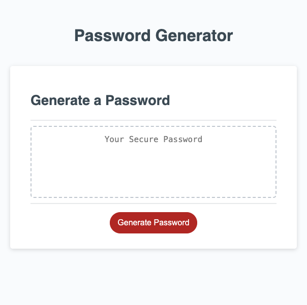

# password-generator
This repository contains an HTML, CSS, and JavaScript file that work together to create a password generator. This password generator gives users the ability to specifiy how many characters they need in their password. It also gives them the ability to specify if they would like special characters, lowercase, and/or uppercase characters in their password. When all have been selected the site generates a random password based on the users needs and provides it to them. This will be useful to anyone needing a randomly generated password with certain specifications required. This site uses JavaScript to select random characters based on the users needs, fitting within the character restraints, to generate the password. 

## Image of the site

## Link to deployed site
https://floconno.github.io/password-generator/ 
